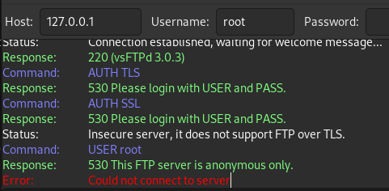
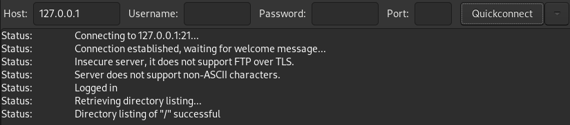
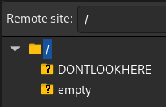
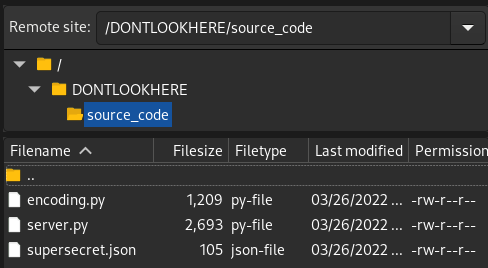

# Write up for CTF-Guess-The-Password

## We're given:
```
Name: 
Password Guess?

Description: 
We found a VP's box, but when we try to brute force his short password, we get rate limited! Can you find a way around the rate limiting to get the password?

127.0.0.1 9009
```

## Getting started

So to start with lets ncat the given ip and port and see what's being hosted there.


```
[michael] ~ > ncat 127.0.0.1 9009 -v                                     
Ncat: Version 7.80 ( https://nmap.org/ncat )
Ncat: Connected to 127.0.0.1:9009.

Enter the passcode to access the secret: 
test
That password isn't right!
	Hint: Your password might be a date in the format YYMMDD

Closing connection...
```

So that lets us know that the password is some 6 digit integer, so we could try to brute force the password, but we quickly find out that the server has some pretty liberal rate limiting...

```
[michael] ~ > ncat 127.0.0.1 9009
Enter the passcode to access the secret: 
test
That password isn't right!
	Hint: Your password might be a date in the format YYMMDD

Closing connection...

[michael] ~ > ncat 127.0.0.1 9009
You are being rate limited
```

-----

## Taking a different approach

Okay so trying to brute force the password is going to take too long, and obviously isn't the intended solution, so let's try something else.

Let's see if there are any other ports are open, maybe there's something else we can try. We can do a quick port scan with nmap

```
[michael] ~ > nmap -sT 127.0.0.1
Starting Nmap 7.80 ( https://nmap.org ) at 2022-03-26 01:23 EDT
Nmap scan report for localhost (127.0.0.1)
Host is up (0.00012s latency).
Not shown: 997 closed ports
PORT     STATE SERVICE
20/tcp   open  ftp-data
21/tcp   open  ftp
9009/tcp open  pichat
```

Okay, interesting! Looks like ftp is open. Let's see if we can poke around, maybe we can grab files from the server or something...

------
## Checking out FTP

We can try to connect to the FTP server, I like using Filezilla for FTP stuff so I'm going to use that.



Upon trying to connect as root we get denied and told that the server is anonymous only... 

We can reconnect without a username and we get the following



Okay cool, we're in. Let's see what we have to work with!



With a name like "DONTLOOKHERE" it's obviously the first place we check!



Okay it looks like we have some "source code" for something... Let's download it and take a quick look.

-----

## Analysing the source code

When we take a look at the "source code", it quickly becomes apparent that this is the source code for the server we were trying to get into earlier, lucky!

Skimming through server.py there's a snippet that jumps out at me:
```python
if len(user_input) == 6 and self.encoder.check_input(user_input):
            secret = self.encoder.flag_from_pwd(user_input)
            response = "RITSEC[{0}]\n".format(secret) .replace('[','{') .replace(']','}')

